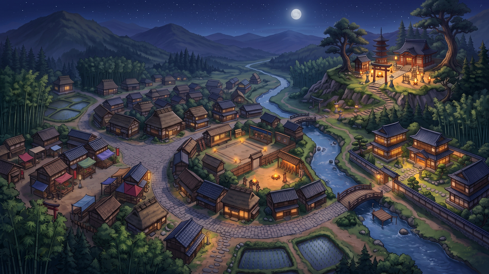
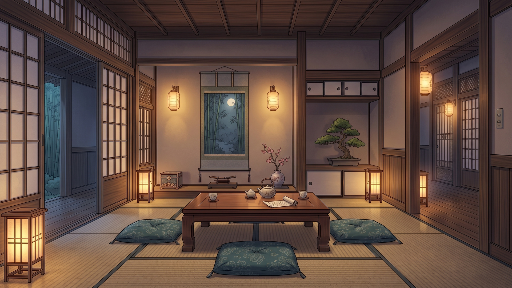
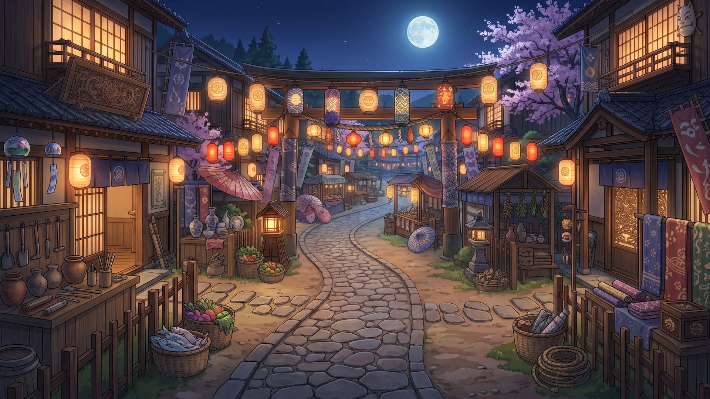

# Nightfall Village — Shinobi Sandbox Portfolio Candidate

**Ren'Py 8.3.7 • Python • v0.15.0**

Nightfall Village is an original sandbox visual-novel portfolio sample focused on the engineering and content-workflow problems found in a large nonlinear Ren'Py project: free location navigation, time-sensitive events, NPC schedules, relationship routes, persistent progression, save/load UX, interactive hotspots, and developer tooling.

## What this candidate demonstrates

- Persistent playthrough structure: the player starts a save and freely decides where to go and what to do.
- Morning / Day / Evening / Night world state with a matching dynamic village map.
- Scene-based exploration with hover-only interaction labels and direct click actions.
- HoS-inspired contextual location dock: room/location icons, direct movement, hover names, and green availability markers.
- Circular world-map destinations with real location previews.
- Protagonist home, Aya's home, village, market, training grounds, riverside, shrine, hidden passage, and archive.
- NPC schedules and conditional presence.
- Love / Hatred relationship routes and relationship-gated content.
- Strength, Reputation, coins, energy, inventory, quest flags, and unlockable locations.
- Data-driven conditional events with location, time, day, item, stat, relationship, prerequisite, and priority rules.
- Custom main menu, save/load, preferences, gallery/replay, HUD, and dialogue presentation.
- Developer-only event inspection and state testing tools.

## Visual tour

### Dynamic world map

### Player home

### Aya household

### Market

## Five-minute reviewer route

1. Start a new game from **COMENZAR**.
2. In the protagonist home, use the bottom location dock to move between rooms without menu prompts.
3. Hover scene hotspots to see interaction names, then click to interact directly.
4. Open **MAP** from the polished top HUD and inspect the circular image-based destinations.
5. Visit Aya's house to see household navigation, relationship state, schedules, and event gating.
6. Visit Market / Training / Riverside to see the larger explorable world and time-dependent content.
7. Save, return to the menu, and load the same persistent playthrough.

## Technical structure

The project intentionally separates reusable state/rules from narrative content and presentation:

- `game/systems.rpy` — time, schedules, relationships, inventory, event requirements, progression helpers.
- `game/events.rpy` — narrative/event definitions.
- `game/script.rpy` — main sandbox flow and action labels.
- `game/zzzzzzzzzzzzzzzzzzzzzzzzzzzzzzzzz_v130_interactive_world.rpy` — scene/zone model and interactive exploration.
- `game/zzzzzzzzzzzzzzzzzzzzzzzzzzzzzzzzzzzzzzzzz_v142_master_world_hotspots.rpy` — master-art hotspot alignment.
- `game/zzzzzzzzzzzzzzzzzzzzzzzzzzzzzzzzzzzzzzzzzzzz_v145_direct_hover_navigation.rpy` — hover-only direct interaction flow.
- `game/zzzzzzzzzzzzzzzzzzzzzzzzzzzzzzzzzzzzzzzzzzzzzz_v147_map_png_mask_fix.rpy` — final circular map implementation.
- `game/zzzzzzzzzzzzzzzzzzzzzzzzzzzzzzzzzzzzzzzzzzzzzz_v147_restore_polished_hud.rpy` — polished icon HUD.
- `game/zzzzzzzzzzzzzzzzzzzzzzzzzzzzzzzzzzzzzzzzzzzzzzzz_v148_hos_location_dock.rpy` — contextual bottom navigation.

See [`ARCHITECTURE.md`](ARCHITECTURE.md) for the active candidate layers and why some versioned modules remain separate.

## Running locally

Open the repository as a Ren'Py project with **Ren'Py 8.3.7** and launch it normally. Generated caches and `.rpyc` files are ignored by Git.

For reviewers who do not have Ren'Py installed, the repository includes a GitHub Actions candidate workflow that audits the project and builds a Windows distribution. Candidate builds are published as workflow artifacts, and the v0.15.0 candidate job can publish a GitHub Release automatically.

## Portfolio scope and asset disclosure

This project does **not** contain House of Shinobi source code, proprietary art, characters, dialogue, story content, or extracted game assets. The project is original and was built specifically to demonstrate relevant technical categories and sandbox UX patterns.

Some environment and character presentation artwork is **AI-assisted prototype art**. The portfolio focus is the Ren'Py/Python implementation: system architecture, state management, conditional events, navigation, UI integration, debugging workflow, and iterative product polish.

## QA and presentation

- [`QA_CHECKLIST.md`](QA_CHECKLIST.md) — final manual presentation pass.
- [`PORTFOLIO_VIDEO_SCRIPT.md`](PORTFOLIO_VIDEO_SCRIPT.md) — 60–90 second demo recording plan.
- [`PORTFOLIO_NOTES.md`](PORTFOLIO_NOTES.md) — interview talking points.
- [`HOS_DIRECT_SAMPLE.md`](HOS_DIRECT_SAMPLE.md) — direct relevance statement.
- [`CHANGELOG.md`](CHANGELOG.md) — project evolution.

## Status

**v0.15.0 — Portfolio Candidate**

The feature set is intentionally frozen for presentation. Remaining work should be limited to bug fixes, alignment tweaks, and reviewer-facing polish rather than new systems.